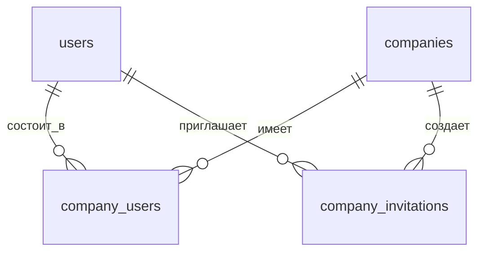
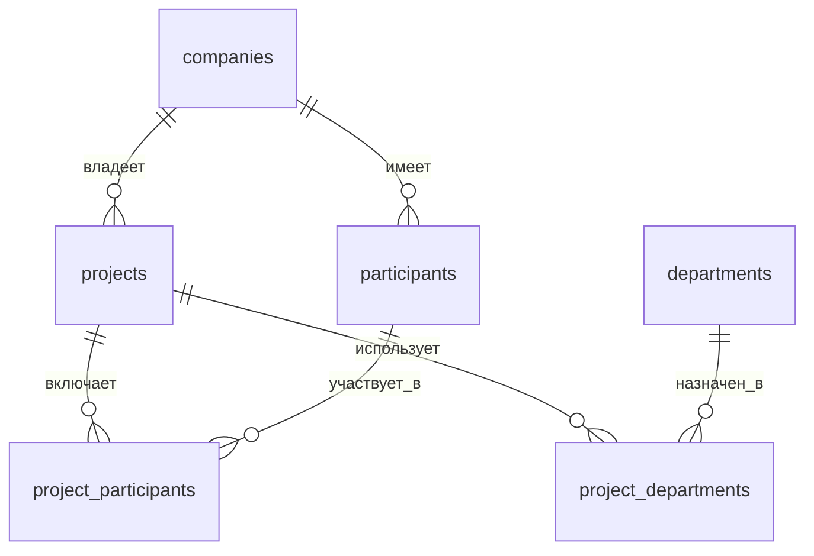
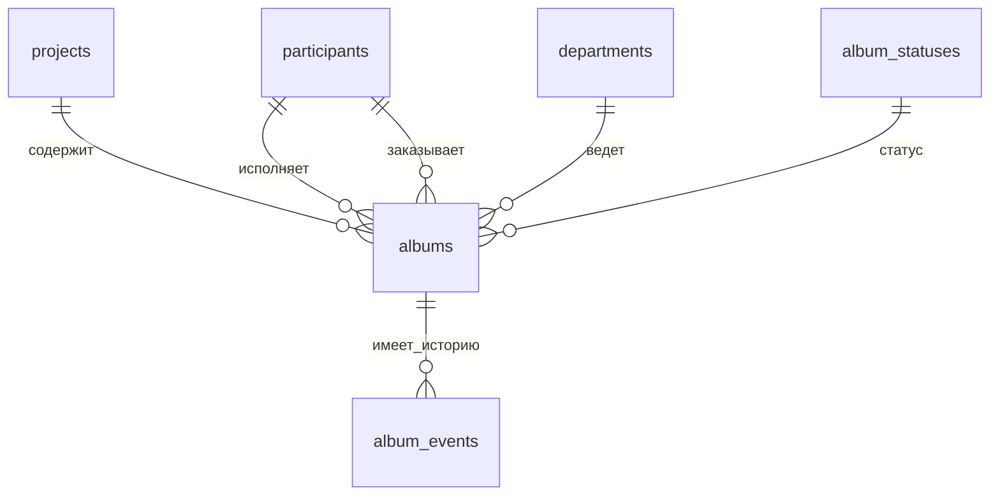

# Архитектура базы данных KlamBot.ru

## Общая концепция

KlamBot.ru использует **мульти-тенантную** архитектуру с компаниями (`companies`) в качестве основного уровня изоляции данных.

```
┌─────────────────────────────────────────────────────────────┐
│                        КОМПАНИЯ (Tenant)                     │
│  ┌────────────┐  ┌──────────────┐  ┌─────────────────────┐ │
│  │   Users    │  │ Participants │  │   Projects          │ │
│  │  (Админы)  │  │ (Исполнители)│  │  ┌──────────────┐  │ │
│  └────────────┘  └──────────────┘  │  │   Albums     │  │ │
│                                     │  │  (Статусы)   │  │ │
│                                     │  └──────────────┘  │ │
│                                     └─────────────────────┘ │
└─────────────────────────────────────────────────────────────┘
```

---

## 📊 Диаграмма взаимосвязей

### Уровень 1: Пользователи и Компании



**Описание:**
- Один `user` может состоять в нескольких `companies`
- В `company_users` хранится роль: `owner`, `admin`, `member`
- `company_invitations` - приглашения новых пользователей

---

### Уровень 2: Проекты и Участники



**Описание:**
- Проект принадлежит компании
- Участники (`participants`) - люди, которые работают в проектах
- Участник может быть `executor` или `customer`
- Проект связан с отделами через `project_departments`

---

### Уровень 3: Альбомы и События



**Описание:**
- Альбом - основная единица работы
- У каждого альбома есть исполнитель и заказчик
- История изменений статусов хранится в `album_events`
- Статусы: `upload`, `sent`, `accepted`, `pending`, `remarks`, `production`

---

## 🗂️ Описание таблиц

### 1. Аутентификация и пользователи

#### `users`
Пользователи системы, логинятся через Telegram.

| Поле | Тип | Описание |
|------|-----|----------|
| id | BIGINT | Первичный ключ |
| telegram_id | BIGINT | ID в Telegram (уникальный) |
| telegram_username | VARCHAR | Username в Telegram |
| first_name | VARCHAR | Имя |
| last_name | VARCHAR | Фамилия |
| email | VARCHAR | Email (опционально) |

**Связи:**
- → `company_users` (пользователь состоит в компаниях)
- → `auth_sessions` (активные сессии)
- → `notification_settings` (настройки уведомлений)

#### `auth_sessions`
Активные сессии пользователей (JWT токены).

---

### 2. Компании (Multi-tenancy)

#### `companies`
Компании - основной уровень изоляции данных.

| Поле | Тип | Описание |
|------|-----|----------|
| id | BIGINT | Первичный ключ |
| name | VARCHAR | Название компании |
| created_by_user_id | BIGINT | Кто создал компанию |

**Связи:**
- ← `company_users` (пользователи компании)
- → `projects` (проекты компании)
- → `participants` (участники проектов)
- → `album_templates` (шаблоны альбомов)

#### `company_users`
Связь пользователей с компаниями + роль.

| Поле | Тип | Описание |
|------|-----|----------|
| company_id | BIGINT | ID компании |
| user_id | BIGINT | ID пользователя |
| role_in_company | ENUM | `owner`, `admin`, `member` |

---

### 3. Участники проектов

#### `participants`
Люди, которые участвуют в проектах (не обязательно пользователи системы).

| Поле | Тип | Описание |
|------|-----|----------|
| id | BIGINT | Первичный ключ |
| company_id | BIGINT | Компания |
| first_name | VARCHAR | Имя |
| last_name | VARCHAR | Фамилия |
| telegram_id | BIGINT | ID в Telegram (опционально) |
| role_type | ENUM | `executor`, `customer` |
| is_active | BOOLEAN | Активен ли участник |

**Связи:**
- → `project_participants` (участие в проектах)
- → `albums` (исполнитель/заказчик альбома)

---

### 4. Справочники

#### `departments`
Отделы компании.

| code | name |
|------|------|
| KR | Конструкторский отдел |
| AR | Архитектурный отдел |
| ES | Отдел электроснабжения |
| SS | Отдел слаботочных систем |
| GP | Отдел генерального плана |
| OVVK | Отдел ОВКВ |

#### `album_statuses`
Статусы альбомов.

| code | name | color |
|------|------|-------|
| upload | Загрузка | #94a3b8 |
| sent | Отправлено | #60a5fa |
| accepted | Принято | #4ade80 |
| pending | На рассмотрении | #fbbf24 |
| remarks | Замечания | #fb923c |
| production | В производстве | #a78bfa |

---

### 5. Проекты

#### `projects`
Проекты компании.

| Поле | Тип | Описание |
|------|-----|----------|
| id | BIGINT | Первичный ключ |
| company_id | BIGINT | Компания-владелец |
| name | VARCHAR | Название проекта |
| code | VARCHAR | Код проекта (уникален в рамках компании) |
| customer_company_name | VARCHAR | Название компании-заказчика |
| owner_user_id | BIGINT | Владелец проекта |

**Связи:**
- → `project_departments` (отделы проекта)
- → `project_participants` (участники проекта)
- → `project_channels` (Telegram-каналы)
- → `albums` (альбомы проекта)

#### `project_participants`
Участники конкретного проекта.

| Поле | Тип | Описание |
|------|-----|----------|
| project_id | BIGINT | Проект |
| participant_id | BIGINT | Участник |
| role_project | ENUM | `member`, `manager`, `viewer`, `admin` |

---

### 6. Альбомы

#### `albums`
Альбомы - основная единица работы.

| Поле | Тип | Описание |
|------|-----|----------|
| id | BIGINT | Первичный ключ |
| project_id | BIGINT | Проект |
| name | VARCHAR | Название альбома |
| code | VARCHAR | Код (уникален в рамках проекта) |
| department_id | BIGINT | Отдел |
| executor_id | BIGINT | Исполнитель |
| customer_id | BIGINT | Заказчик |
| deadline | DATE | Срок сдачи |
| status_id | BIGINT | Текущий статус |
| last_status_at | DATETIME | Время последнего изменения статуса |
| link | VARCHAR | Ссылка на файлы |
| telegram_thread_id | BIGINT | ID треда в Telegram |

**Связи:**
- → `album_events` (история изменений)

#### `album_events`
История изменений статусов альбома.

| Поле | Тип | Описание |
|------|-----|----------|
| id | BIGINT | Первичный ключ |
| album_id | BIGINT | Альбом |
| status_id | BIGINT | Новый статус |
| comment | TEXT | Комментарий |
| created_by_user_id | BIGINT | Кто создал (из веба) |
| created_by_participant_id | BIGINT | Кто создал (из Telegram) |
| source | ENUM | `telegram`, `web`, `api` |
| telegram_message_id | BIGINT | ID сообщения в Telegram |

**Важно:** Либо `created_by_user_id`, либо `created_by_participant_id` должен быть заполнен (CHECK constraint).

---

### 7. Шаблоны альбомов

#### `album_templates`
Шаблоны для быстрого создания набора альбомов.

#### `album_template_items`
Элементы шаблона (отдельные альбомы).

---

## 🔐 Ключевые ограничения

### Unique Constraints
- `users.telegram_id` - один Telegram аккаунт = один пользователь
- `(company_id, user_id)` в `company_users` - пользователь не может дважды быть в одной компании
- `(project_id, code)` в `albums` - код альбома уникален в рамках проекта
- `(company_id, code)` в `projects` - код проекта уникален в рамках компании

### Foreign Key Constraints
- `ON DELETE CASCADE` - при удалении родителя удаляются дочерние записи
- `ON DELETE RESTRICT` - при удалении участника проверяется, что он не используется в альбомах
- `ON DELETE SET NULL` - при удалении пользователя его записи сохраняются, но ссылка обнуляется

### Check Constraints
- В `album_events` проверка, что заполнен либо `created_by_user_id`, либо `created_by_participant_id`

---

## 📈 Индексы для производительности

Все важные поля проиндексированы:

- **Foreign keys** - все внешние ключи
- **Поиск по статусам** - `albums.status_id`, `album_events.status_id`
- **Поиск по дедлайнам** - `albums.deadline`
- **История событий** - `(album_id, created_at)` для быстрой выборки истории

---

## 🔄 Типичные запросы

### Получить все альбомы проекта с текущим статусом

```sql
SELECT 
    a.*,
    s.name as status_name,
    s.color_hex,
    d.name as department_name,
    e.first_name as executor_name,
    c.first_name as customer_name
FROM albums a
JOIN album_statuses s ON a.status_id = s.id
JOIN departments d ON a.department_id = d.id
JOIN participants e ON a.executor_id = e.id
JOIN participants c ON a.customer_id = c.id
WHERE a.project_id = ?
ORDER BY a.code;
```

### Получить историю изменений альбома

```sql
SELECT 
    ae.*,
    s.name as status_name,
    COALESCE(u.first_name, p.first_name) as author_name
FROM album_events ae
JOIN album_statuses s ON ae.status_id = s.id
LEFT JOIN users u ON ae.created_by_user_id = u.id
LEFT JOIN participants p ON ae.created_by_participant_id = p.id
WHERE ae.album_id = ?
ORDER BY ae.created_at DESC;
```

### Получить все проекты компании с количеством альбомов

```sql
SELECT 
    p.*,
    COUNT(a.id) as albums_count
FROM projects p
LEFT JOIN albums a ON p.id = a.project_id
WHERE p.company_id = ?
GROUP BY p.id
ORDER BY p.created_at DESC;
```

---

## 🚀 Масштабирование

### Партиционирование
Для больших таблиц можно использовать партиционирование:
- `album_events` - по дате создания (по месяцам)
- `auth_sessions` - по дате истечения

### Архивирование
Старые данные можно переносить в архивные таблицы:
- События старше 2 лет
- Неактивные проекты

---

## 📝 Миграции

Все изменения схемы должны быть оформлены как миграции:

```
migrations/
├── 001_initial_schema.sql
├── 002_seed_dictionaries.sql
└── 003_add_new_feature.sql
```

Для применения: `npm run db:migrate`

---

**Дата последнего обновления:** 2025-01-13
